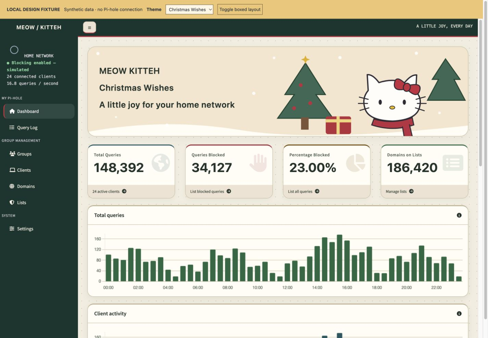
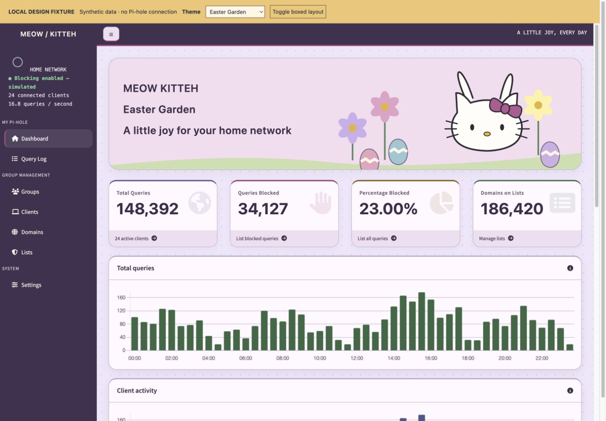
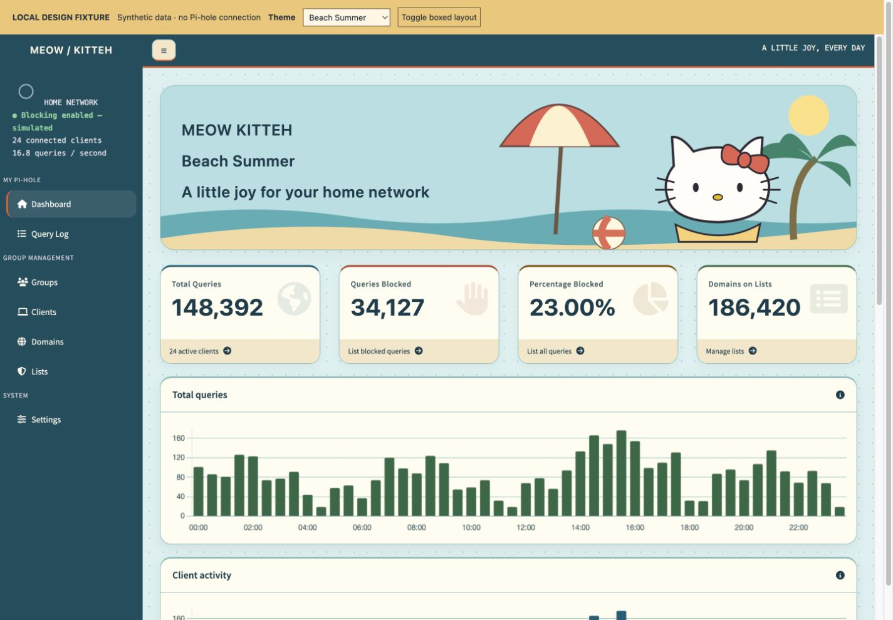
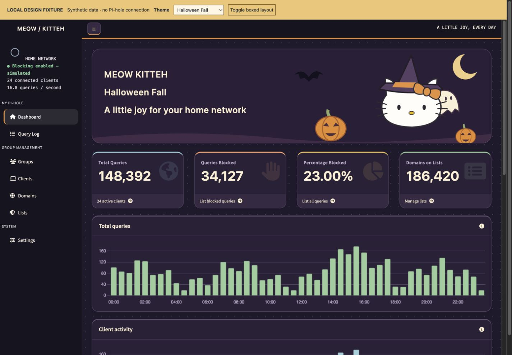

# Meow Kitteh for Pi-hole

An unofficial seasonal fan-theme collection for Pi-hole v6, made for Nilesh. Separate from [Galactic Network Defense](https://github.com/RamrattanN/pi-hole-galactic-theme).

**Experimental dashboard prototype. No live Pi-hole runtime validation or stable release yet.**

| Christmas Wishes | Easter Garden |
| --- | --- |
|  |  |

| Beach Summer | Halloween Fall |
| --- | --- |
|  |  |

- **Christmas Wishes:** cream, forest green and cranberry; trees, gifts and a red scarf.
- **Easter Garden:** lavender, rose and pale green; flowers, eggs and bunny ears.
- **Beach Summer:** aqua, warm sand and coral; an umbrella, palm tree and beach ball.
- **Halloween Fall:** deep plum, pumpkin orange and moonlight cream; pumpkins, a friendly ghost and a witch hat.

The character artwork is newly drawn SVG fan art, embedded in the installable CSS. It is not merely a preview decoration. Normal Pi-hole text, charts, links and controls remain in place. Seasonal selection is manual; no calendar automation or live data is invented. Other pages use the upstream light/dark base theme.

## Preview locally

```sh
python3 scripts/build.py
python3 scripts/build_runner.py
python3 -m unittest discover -s tests -v
git clone https://github.com/pi-hole/web.git .preview-upstream
git -C .preview-upstream checkout b2a4078446519c58d84f199663ca9326d5d311f0
python3 scripts/preview.py --upstream .preview-upstream --port 8766
```

Open http://127.0.0.1:8766. The four-season selector belongs to the local preview; the real Pi-hole still uses its existing LCARS theme slot. All preview statistics are synthetic. The dashboard body uses pinned upstream markup; the surrounding shell and chart data are fixture substitutes. Upstream assets are copied only into an ignored local render directory.

## Install, switch season or remove

Read the [curl runner guide](docs/CURL-RUNNER.md) and [installation/recovery notes](docs/INSTALLATION.md). Requires Python 3.9+ on Unix. All actions default to dry-run.

```sh
sh run.sh install --theme kitty-christmas
sh run.sh upgrade --theme kitty-easter
sh run.sh upgrade --theme kitty-beach-summer
sh run.sh upgrade --theme kitty-halloween-fall
sh run.sh uninstall
```

Append `--apply` only on your approved test host. The runner preserves the installed season when `upgrade` omits `--theme`. No Pi-hole configuration or credentials are accessed. After installation, manually select the existing LCARS slot and hard-refresh.

**Switching projects:** Galactic and Meow Kitteh both occupy `style/themes/lcars.css`. Uninstall the previous collection with its original runner and restore directory before installing this collection. Keep their restore directories separate. Do not stack installations and expect either project to manage the other's journal.

## Compatibility and workflow

Target: inspected Pi-hole Web **v6.6**, commit `b2a4078446519c58d84f199663ca9326d5d311f0`. Seven upstream file hashes gate installation and upgrades. See [compatibility](docs/COMPATIBILITY.md) and [test record](docs/TESTING.md). This does not certify the running Core/FTL/container combination.

Development is on `develop`; `main` is reserved for reviewed releases. See [contributing](CONTRIBUTING.md). No Nilesh production system has been accessed.

## Licensing and affiliation

Unofficial fan project, not affiliated with or endorsed by Sanrio or Pi-hole. Original interface/tooling code is MIT licensed. The code license does not grant third-party character or trademark rights; Hello Kitty artwork and its embedded copies are excluded from that blanket grant. Read [ARTWORK-NOTICE.md](ARTWORK-NOTICE.md) and [third-party notices](THIRD_PARTY_NOTICES.md).
